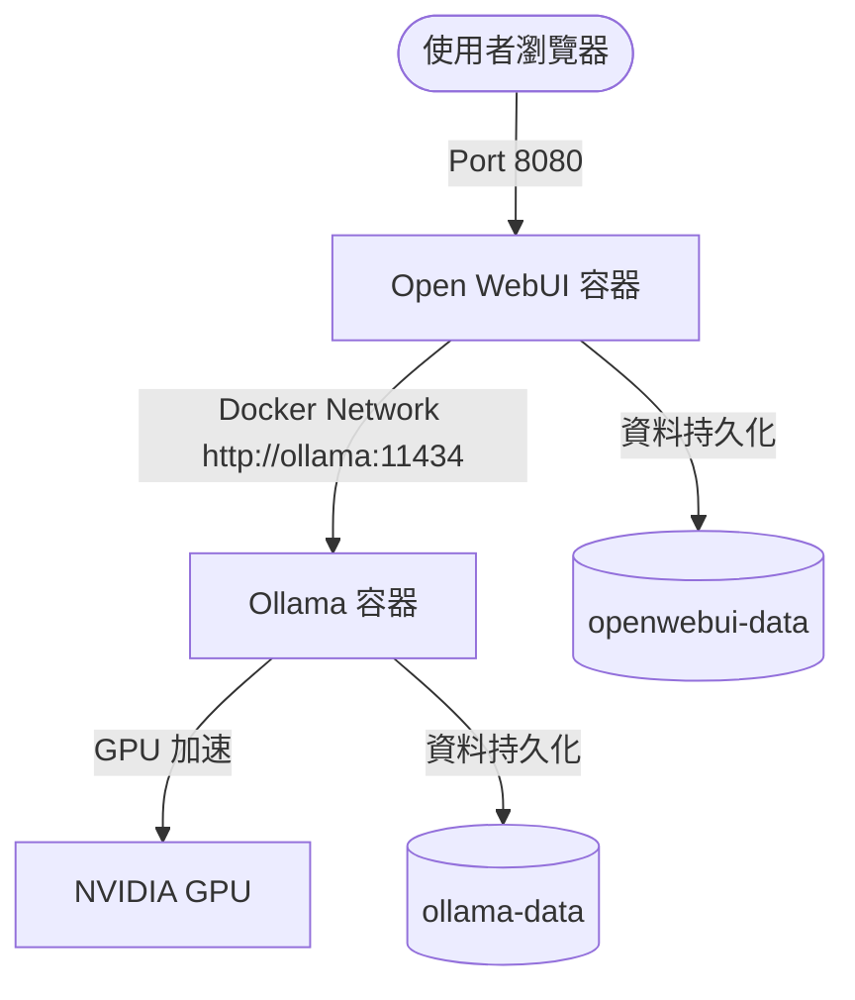

# Ollama + Open WebUI Docker Compose 部署與優化指南

本目錄提供了一套基於 Docker Compose 的 **Ollama** 與 **Open WebUI** 整合部署設定。此配置預設啟用 NVIDIA GPU 支援，以加速大型語言模型（LLM）的推論與載入速度。

## 目錄檔案
* [docker-compose.yml](file:///mnt/c/Users/user/Documents/Configuration/script-container-docs/Container/ollama/docker-compose.yml)：定義 Ollama 及 Open WebUI 服務的設定檔。

---

## 服務架構說明

本配置啟動以下兩個主要服務：



### 1. Ollama (`ollama`)
* **功能**：負責載入、管理與執行大型語言模型（如 Llama 3、Gemma 2、Mistral 等）的 API 伺服器。
* **連接埠**：對外映射 `11434:11434`。
* **儲存空間**：使用 Docker 磁碟卷 `ollama-data` 儲存所有下載的模型，路徑對應容器內的 `/root/.ollama`。
* **硬體加速**：透過 `deploy` 設定調用 1 個 NVIDIA GPU。

### 2. Open WebUI (`openwebui`)
* **功能**：為 Ollama 提供類似 ChatGPT/Claude 的網頁聊天介面，支援多用戶、語音輸入、文件檢索（RAG）、自訂 Prompt 模版等功能。
* **連接埠**：對外映射 `8080:8080`（可透過 `http://localhost:8080` 存取）。
* **儲存空間**：使用 Docker 磁碟卷 `openwebui-data` 儲存帳號、聊天紀錄與向量資料庫。
* **環境變數**：`OLLAMA_BASE_URL=http://ollama:11434` 指向同一個 Docker 網路底下的 Ollama 服務。

---

## 詳細使用步驟

### 1. 前置硬體與驅動檢查
在啟動前，請確認主機滿足以下條件：
* **硬體要求**：建議至少 16GB 以上系統記憶體，顯示卡 VRAM 建議 8GB 以上（運行 7B/8B 模型）。
* **NVIDIA 顯示卡驅動**：執行 `nvidia-smi` 必須有正確的驅動輸出。
* **Docker 與 Compose**：建議安裝 Docker Engine 20.10+ 及 Docker Compose v2.0+。
* **NVIDIA Container Toolkit**：
  請依作業系統執行安裝。以 Ubuntu 為例：
  ```bash
  # 1. 設定套件庫
  curl -fsSL https://nvidia.github.io/libnvidia-container/gpgkey | sudo gpg --dearmor -o /usr/share/keyrings/nvidia-container-toolkit-keyring.gpg \
    && curl -s -L https://nvidia.github.io/libnvidia-container/stable/deb/nvidia-container-toolkit.list | \
      sed 's#deb https://#deb [signed-by=/usr/share/keyrings/nvidia-container-toolkit-keyring.gpg] https://#g' | \
      sudo tee /etc/apt/sources.list.d/nvidia-container-toolkit.list
  
  # 2. 安裝套件
  sudo apt-get update
  sudo apt-get install -y nvidia-container-toolkit
  
  # 3. 設定與重啟 Docker
  sudo nvidia-container-toolkit-ctl setup --runtime=docker
  sudo systemctl restart docker
  ```

### 2. 啟動服務
於本目錄下執行：
```bash
docker compose up -d
```
使用 `docker compose ps` 確認兩個容器狀態皆為 `Up`。

### 3. 初始化 Open WebUI
1. 瀏覽器開啟 `http://localhost:8080`。
2. **註冊管理員**：點選 "Sign Up"，輸入姓名、Email 與密碼。**第一個註冊的帳號將被自動賦予 Admin（管理員）權限**。
3. **下載模型**：
   * 以管理員身份登入後，進入左下角 **管理控制台** -> **設定** -> **模型**。
   * 在「拉取模型」輸入 `llama3:8b`（或 `gemma2`）並點擊下載。

### 4. 驗證 GPU 加速是否運作
當模型開始回答問題時，可以在主機終端機執行：
```bash
nvidia-smi
```
觀察是否有 `ollama` 的處理程序（Processes）在使用顯示卡記憶體（VRAM），且 GPU 使用率（GPU-Util）有上升，以確認 GPU 成功參與運算。

---

## 進階調整與安全性注意事項

### 1. 安全性：防範 API 未授權存取 ⚠️
預設設定中，Ollama 映射了 `11434:11434` 到主機所有網路介面（`0.0.0.0`）。如果您的伺服器有公網 IP 且沒有防火牆阻擋，**任何人都可以透過該連接埠存取您的 Ollama API 並下載/執行模型，這會造成嚴重的資源濫用與安全隱患。**

* **建議改進**：若您不需要從主機外部存取 Ollama API，請修改 [docker-compose.yml](file:///mnt/c/Users/user/Documents/Configuration/script-container-docs/Container/ollama/docker-compose.yml)，將埠口綁定限制在本地端：
  ```yaml
  ports:
    - 127.0.0.1:11434:11434
  ```

### 2. 安全性：關閉 WebUI 公開註冊
當您的 Open WebUI 被放置於公網時，預設是允許任何人自行註冊帳號並使用您的 GPU 資源的。
* **調整方式**：在 [docker-compose.yml](file:///mnt/c/Users/user/Documents/Configuration/script-container-docs/Container/ollama/docker-compose.yml) 中的 `open-webui` 服務加入 `WEBUI_SIGNUP_ALLOWED` 環境變數：
  ```yaml
  environment:
    - OLLAMA_BASE_URL=http://ollama:11434
    - WEBUI_SIGNUP_ALLOWED=false # 關閉公開註冊，新用戶需由管理員手動新增
  ```

### 3. CPU 模式運行設定（無 GPU 環境）
若您是在無獨立顯示卡的伺服器（如純 CPU 的 VPS 虛擬主機）上運行，請修改 [docker-compose.yml](file:///mnt/c/Users/user/Documents/Configuration/script-container-docs/Container/ollama/docker-compose.yml)，移除 `ollama` 底下的 `deploy` 設定：
```yaml
# 移除這整段以避免啟動錯誤：
deploy:
  resources:
    reservations:
      devices:
        - driver: nvidia
          count: 1
          capabilities: [gpu]
```

### 4. 備份與還原
* **備份模型**：Ollama 下載的模型皆在 `ollama-data` 磁碟卷中，若要備份可將 Docker 磁碟卷打包。
* **備份用戶與對話紀錄**：WebUI 的所有資料都在 `openwebui-data` 中（內含 SQLite 資料庫與上傳的知識庫文件），**建議定期備份此磁碟卷**以防資料毀損。
