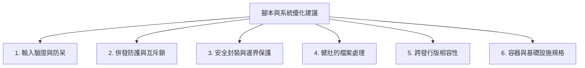

# 系統架構與代碼優化建議報告 (Suggestions & Best Practices)

> **建立時間**：2026-07-22  
> **重點領域**：維運安全性、健壯性、跨平台相容性與標準化規範

---

## 1. 核心優化建議總覽

基於前文之審查發現，我們針對專案提出以下 6 大優化領域與具體實施建議：



---

## 2. 具體建議指導方案

### 💡 建議 1：全面引進高強度輸入驗證規範 (Input Validation Standard)

所有接受互動式輸入或環境變數的腳本（如 `initial-setup.sh`），必須落實**先驗證後執行**原則：

1. **IPv4 格式驗證**：
   * 正則表達式：`^(0|[1-9][0-9]*)\.(0|[1-9][0-9]*)\.(0|[1-9][0-9]*)\.(0|[1-9][0-9]*)$`
   * 每個 Octet 數值範圍必須落在 $0 \le \text{octet} \le 255$。
   * **嚴格阻擋前導零**（例如 `192.168.01.1`），避免 Bash 算術運算將其視為八進位造成剖析崩潰。

2. **Subnet Mask / CIDR 轉換**：
   * 支援 CIDR prefix (0–32) 以及 dotted-decimal netmask (如 `255.255.255.0`)。
   * 採用純 Bash 位元運算的 `mask_to_cidr` 轉換函式，消除對外部工具 `bc` 的依賴。

3. **FQDN / Hostname 驗證**：
   * 長度限定在 1 至 253 字元，單一 Label 不超過 63 字元。
   * 僅允許半形英數字、連字號 (`-`) 與句號 (`.`)，禁止以連字號或句號開頭或結尾。

---

### 💡 建議 2：建立全域互斥鎖防護併發衝突 (Concurrency Locking)

為避免多個 SSH 階段或實體 Console 同時登入 root 觸發多重精靈流程，必須在所有互動式初始化腳本開頭導入原子性 Lock 機制：

```bash
LOCK_DIR="/run/initial-setup.lock"

# 使用 mkdir 實現原子鎖 (Atomic Lock)
if ! mkdir "$LOCK_DIR" 2>/dev/null; then
    echo "警告: 另一個 initial-setup 實例正在執行中。本次執行已自動取消。"
    exit 0
fi

# 確保腳本退出（正常或例外中斷）時會自動清理 Lock 目錄
trap 'rm -rf "$LOCK_DIR"' EXIT
```

---

### 💡 建议 3：VM 範本封裝資安與維護性標準 (VM Sealing Protocol)

對於 `seal-rhel-template.sh`，封裝清理應遵循以下規範：

1. **`/etc/hosts` 精準修剪而非強制覆寫**：
   * 不應使用 `cat > /etc/hosts` 抹除全檔。
   * 應使用 `sed` 僅刪除或替換舊有 Hostname 條目，保留管理員配置的解析設定：
     ```bash
     sed -i '/^[[:space:]]*127\.0\.0\.1[[:space:]]/ s/[[:space:]]\+'"$OLD_HOSTNAME"'//g' /etc/hosts
     ```

2. **符合 systemd 規範的 Machine-ID 重置**：
   * 禁止寫入 `"uninitialized\n"` 字串。
   * 正確作法：直接刪除 `/etc/machine-id` 檔案，或將其重置為 0 位元組的空檔案：
     ```bash
     rm -f /var/lib/dbus/machine-id
     : > /etc/machine-id
     chmod 644 /etc/machine-id
     ```

3. **支援全系列 RHEL 相容發行版**：
   * OS 檢測應包含 `rhel`, `rocky`, `almalinux`, `centos`, `fedora` 等所有衍生版。

---

### 💡 建議 4：Proxmox VE 符號連結同步健壯化 (Symlink Synchronization)

對於 ISO 連結腳本 `pve_link_iso.sh`：

1. **安全判斷 Symlink 狀態**：
   * 使用 `[ -L "$file" ]` 判斷是否為軟連結，使用 `[ -e "$file" ]` 判斷目標是否存在。
   * 對於失效的軟連結 (Dangling Symlink)，應先強制解綁或覆蓋（`ln -sf`），而非直接跳過。

2. **檔名衝突保護**：
   * 若掃描到不同子目錄下同名的 ISO 檔案，自動加入父目錄名稱前綴或顯示明確警告，避免後者被無聲跳過。

---

### 💡 建議 5：Kubernetes 初始化與 SELinux 漸進式調校

對於 `k8s_env_initialization.sh`：

1. **改用 `/etc/selinux/config` 替代硬核 `selinux=0`**：
   * 將 SELinux 設為 `permissive` 或 `disabled`，避免移除核心模組導致 container-selinux 相關底層服務報錯。
2. **多發行版相容**：
   * 維持對 RHEL 與 Debian/Ubuntu 的分支判斷，強化在無 `grubby` 環境下的相容性。

---

### 💡 建議 6：容器化服務彈性配置 (Docker Compose Hardening)

對於 `docker-compose.yml`：

1. **提供 GPU 選擇性環境檔 (.env)** 或建立 CPU/GPU 分流配置檔。
2. **鎖定穩定映像檔 Tag**：將 `latest` / `main` 替換為具體版號（如 `ollama/ollama:0.5.7`）。
